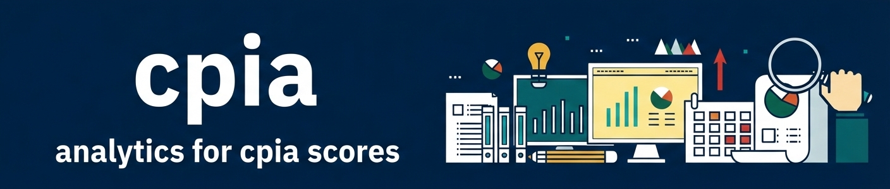

# cpiaapp

[](https://github.com/WB-PIDA-Data-Science-Shop/cpiaapp)

Interactive Shiny dashboard for visualizing World Bank Country Policy and Institutional Assessment (CPIA) governance indicators with time-series analysis and regional/income group comparisons.



## What Does This App Do?

The CPIA Dashboard lets you explore 13 governance indicators across countries and time:
- 📊 **Time-series plots** showing how governance scores change over years
- 🌍 **Regional comparisons** to see how countries stack up against their neighbors
- 💰 **Income group comparisons** to compare similar economies
- 🔀 **Custom comparisons** with multiple countries side-by-side
- 📋 **Interactive tables** with export capabilities (CSV, Excel, PDF)

## Quick Start

```r
# Install from GitHub
devtools::install_github("WB-PIDA-Data-Science-Shop/cpiaapp")

# Run the dashboard
library(cpiaapp)
run_cpiaapp()
```

The app will open in your default browser at `http://127.0.0.1:XXXX`.

## Features

✅ **13 governance questions** from CPIA Cluster D (q12a-q16d including q13c)  
✅ **Dual datasets** - Standard CPIA and African Integrity Indicators  
✅ **Interactive visualizations** powered by plotly (hover, zoom, pan)  
✅ **Modern UI** with bslib theming and automatic plot styling via thematic  
✅ **Robust validation** with clear error messages for data quality issues  
✅ **134 passing tests** ensuring reliability and correctness  

## Package Architecture

The package follows a **modular helper function design** for maintainability:

```
User Interface (viz_ui.R)
         ↓
Orchestration (viz_server.R) - 132 lines
         ↓
Helper Functions (6 utility modules)
    ├── utils_metadata.R    → Question labels & formatting
    ├── utils_data.R        → Dataset validation
    ├── utils_data_prep.R   → Data preparation pipeline
    ├── utils_plot.R        → Plotting pipeline (ggplot2 → plotly)
    ├── utils_table.R       → Interactive tables (DT)
    └── utils_ui.R          → Empty state components
         ↓
Data (cpiaetl package)
```

**Result:** Clean, testable code with 47% reduction in server complexity (280→132 lines).

## Documentation

📚 **[GitHub Wiki](../../wiki)** - Comprehensive technical documentation  
- [Architecture & Design](../../wiki/Architecture-&-Design)
- [Validation System](../../wiki/Validation-System)
- [Module Reference](../../wiki/Module-Reference)
- [Testing Guide](../../wiki/Testing-Guide)
- [Deployment Guide](../../wiki/Deployment)

📖 **R Documentation** - Function reference via `?function_name`

📝 **Vignette** (coming soon) - Tutorial for using the app

## Development Workflow

### Running Tests
```r
devtools::test()          # Run all 134 tests
devtools::check()         # Full R CMD check
```

### Adding New Features
1. **New comparator type** → Add function to `R/utils_data_prep.R`
2. **Modify plots** → Edit functions in `R/utils_plot.R`
3. **Add validation** → Extend `validate_datasets()` in `R/utils_data.R`
4. **Write tests** → Add to appropriate `tests/testthat/test-*.R` file

See [Development Workflow](../../wiki/Development-Workflow) in the wiki for detailed guides.

## Dependencies

**Core:** shiny, bslib, thematic, ggplot2 (3.5.1), plotly (4.12.0), DT, dplyr (1.1.4), tidyr (1.3.1), tibble (3.2.1), cpiaetl  
**Dev:** testthat (≥ 3.0.0), shinytest2  
**R Version:** ≥ 4.1.0 (uses native pipe `|>`)

## Deployment

Deploy to Posit Connect:

```r
# First-time setup
rsconnect::connectApiUser(
  account = "your_username",
  server = "your-connect-server.com",
  apiKey = "your_api_key"
)

# Deploy
rsconnect::deployApp(
  appDir = getwd(),
  appTitle = "CPIA Dashboard",
  server = "your-connect-server.com"
)
```

See [Deployment Guide](../../wiki/Deployment) for troubleshooting.

## Project Status

**Version:** 0.0.0.9000  
**Status:** Production-ready ✅  
**Tests:** 134 passing (0 failures)  
**R CMD Check:** 0 errors, 0 warnings, 0 notes  

## Contributing

Contributions welcome! Please:
1. Fork the repository
2. Create a feature branch
3. Write tests for new functionality
4. Ensure `devtools::check()` passes
5. Submit a pull request

See [Contributing Guide](../../wiki/Development-Workflow#contributing) for details.

## License

MIT

## Contact

**Maintainer:** World Bank PIDA Data Science Shop  
**Repository:** [WB-PIDA-Data-Science-Shop/cpiaapp](https://github.com/WB-PIDA-Data-Science-Shop/cpiaapp)
